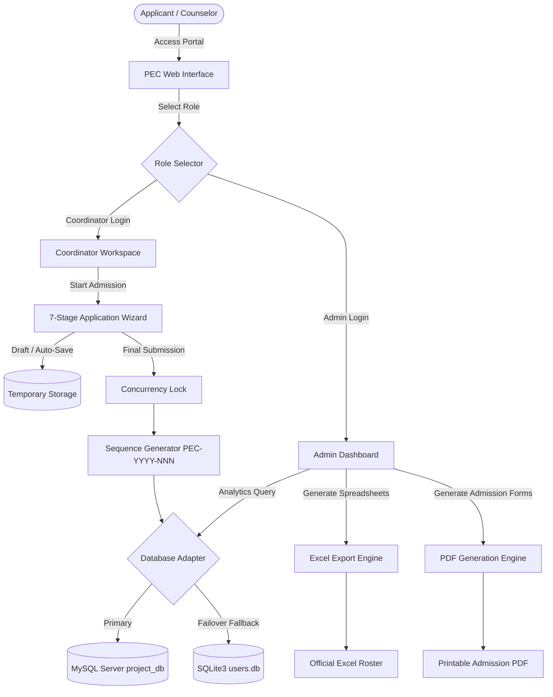

# 🎓 Admission Management System (AMS)
### Prathyusha Engineering College (PEC) — Academic Capstone Project

[](https://www.python.org/)
[](https://flask.palletsprojects.com/)
[](https://www.mysql.com/)
[](https://www.reportlab.com/)
[]()
[]()

---

## 📌 Executive Summary

The **Admission Management System (AMS)** is an enterprise-grade academic admission and student enrollment web application engineered for **Prathyusha Engineering College**. Designed and built as a collaborative **final-year / college capstone project** by a team of **6 engineering students**, AMS completely transforms traditional, paper-heavy admission workflows into an automated, synchronized, and highly secure digital platform.

AMS streamlines candidate registration across a **7-stage multi-step form wizard**, provides dynamic **Role-Based Access Control (RBAC)** for Administrators and Admission Coordinators, prevents sequence collisions via a **thread-safe continuous application number generator**, and provides dynamic reporting through **ReportLab PDF generation** and **OpenPyXL Excel analytics**.

---

## 👥 Project Team & Leadership

This project was successfully delivered by a dedicated team of **6 members**, organized with clear responsibilities and structured milestones.

### 🌟 Team Leadership & Core Contributions
* **Role**: **Team Lead, Full-Stack Engineer & UI/UX Designer**
* **Key Ownership Areas**:
  1. **UI/UX Design & Frontend Architecture**:
     - Conceived, designed, and implemented the complete visual design system and intuitive user journeys.
     - Crafted the responsive, animated college landing portal (`index.html`) and the 7-stage interactive admission wizard with real-time field validation and dynamic previews.
     - Developed glassmorphic, interactive analytics dashboards for both **Admin** and **Admission Coordinators**.
  2. **Backend Development & Systems Engineering**:
     - Built the modular Flask application backend with RESTful API endpoints.
     - Formulated the **thread-safe, collision-free application reservation algorithm** (`PEC<YYYY><NNN>`) using concurrency locking to guarantee zero sequence gaps during concurrent admissions.
     - Architected the **Dual-Engine Database Adapter** with dynamic failover from MySQL (`project_db`) to SQLite (`users.db`) with custom scalar functions (`STR_TO_DATE`, `YEAR`, `MONTH`).
     - Programmed the dynamic reporting suite: automated PDF generation of formatted college admission sheets (`ReportLab`) and administrative Excel exports (`openpyxl`).
  3. **Team Coordination & Project Management**:
     - Defined technical architecture, sprint goals, and task delegations across all 6 team members.
     - Conducted regular code reviews, database schema alignments, bug-triage sessions, and presentation rehearsals for academic evaluation.

### 🤝 Team Roster & Roles Breakdown
| Member | Project Role | Primary Focus Areas |
| :--- | :--- | :--- |
| **Srinivas (Team Lead)** | **Full-Stack Architect, UI/UX & Team Lead** | Overall Project Architecture, UI/UX Design System, Flask Backend, Concurrency Engine, PDF/Excel Reporting, Database Failover, Team Orchestration |
| **Team Member 2** | Frontend & Form Wizard Specialist | Multi-step form client-side validations, DOM manipulations, coordinate field states |
| **Team Member 3** | Database Administrator & Schema Engineer | MySQL relational schemas, indexing, table constraints, migration scripts |
| **Team Member 4** | Document Processing & Media Handler | Student photograph uploads, document verification flows, temp image staging |
| **Team Member 5** | Coordinator Portal & Feedback Module | Coordinator remarks, daily work-log persistence, communication ticketing |
| **Team Member 6** | Quality Assurance, Testing & Documentation | Unit testing, concurrency edge-case testing, SRS documentation & viva prep |

---

## 🚀 Key Features

### 1. 🛡️ Role-Based Access Control (RBAC)
* **Administrative Portal (`/admin`)**:
  - Centralized dashboard featuring live enrollment counters, branch-wise allocations, and quota distributions.
  - Coordinator account creation, credential management, and role revocation.
  - Global feedback aggregation and audit log inspection.
  - One-click bulk Excel and PDF export for university submission.
* **Admission Coordinator Portal (`/coordinator`)**:
  - Dedicated authentication and customized dashboard for admission counselors.
  - Real-time application initiation, temporary drafting, and document verification.
  - Feedback submission and daily work-log tracking.

### 2. 📝 7-Stage Multi-Step Admission Wizard
The admission form breaks down complex institutional data collection into 7 intuitive stages:
1. **Personal & Demographic Details**: Name, Date of Birth, Gender, Blood Group, Nationality, Mother Tongue, and Aadhar details.
2. **Parent / Guardian Information**: Father's, Mother's, and Guardian's particulars, occupations, annual income, contact details, and residential address.
3. **Academic Background**: SSLC and HSC / Intermediate records, board of education, year of passing, subject-wise marks, and automatic aggregate cut-off calculation.
4. **Quota & Category Reservation**: General / Management / Government Quota, Community (OC/BC/MBC/SC/ST), Special Reservations (Sports, Ex-Servicemen, Differently Abled), and First Graduate concessions.
5. **Degree & Branch Preferences**: Choice of engineering branches (CSE, AI&DS, ECE, IT, MECH, etc.) prioritized according to candidate interest.
6. **Photograph & Document Verification**: Live staging and upload of candidate photographs, certificates, and identity proofs.
7. **Final Review & Declaration**: Comprehensive read-only verification sheet with legal undertaking before permanent commitment to the database.

### 3. ⚡ Concurrency-Safe Application Number Generator
* Generates continuous, gapless institutional identifiers formatted as:
  $$\text{PEC} + \text{YYYY} + \text{Sequence Number (e.g., PEC20260012)}$$
* Implements Python `threading.Lock()` and atomic database transaction isolation to ensure that concurrent admissions across multiple counseling desks never generate duplicate numbers or skipped sequences.

### 4. 🔀 Dual Database Engine with Automatic Failover
* **Primary Engine**: Production **MySQL** database (`mysql.connector`) optimized for high-volume transactions and relational integrity.
* **Fallback Engine**: Embedded **SQLite3** (`users.db`) that activates automatically if MySQL is unreachable, utilizing a custom `SQLiteConnWrapper` and `SQLiteCursorWrapper` to emulate MySQL syntax and functions (`STR_TO_DATE`, `YEAR`, `MONTH`, `%s` placeholder normalization).

### 5. 📊 Institutional Reporting Suite
* **Automated Excel Export (`openpyxl`)**: Dynamically compiles admission rosters with detailed headers, branch allocations, and contact data into `.xlsx` spreadsheets for administrative filing.
* **Official PDF Generation (`ReportLab`)**: Generates print-ready, formatted official college admission forms with institutional headers, candidate photo placement, tabular academic marks, and signature blocks.

---

## 🏗️ System Architecture



---

## 💻 Tech Stack

### Frontend
* **HTML5 & Vanilla CSS3**: Semantic layouts, custom glassmorphism, responsive grids, and CSS keyframe animations.
* **JavaScript (ES6+)**: Dynamic form step validation, AJAX asynchronous submissions, image previews, and responsive navigation.

### Backend
* **Python 3.10+**: Core programming language.
* **Flask**: Lightweight, high-performance WSGI web application framework.
* **Werkzeug**: Secure file uploads, cryptographic session management, and routing.

### Database
* **MySQL**: Primary relational database server.
* **SQLite3**: Zero-configuration backup database engine with automated query translation wrappers.

### Document & Reporting Engines
* **ReportLab**: Programmatic PDF canvas rendering for official college application sheets.
* **OpenPyXL**: Real-time workbook creation, styled formatting, and data export.

---

## 📂 Project Structure

```text
AMS--main/
├── app.py                         # Core Flask application, REST routes, concurrency & failover logic
├── create_mysql_schema.py         # MySQL schema generation and initialization script
├── migrate_sqlite_to_mysql.py     # Data migration pipeline from SQLite to MySQL
├── verify_schema.py               # Database integrity and sequence verification tool
├── add_feedback_columns.py        # Database migration utility for feedback extensions
├── check_applications.py          # CLI diagnostic tool to inspect registered applications
├── check_db_status.py             # Database connectivity & health checker
├── check_gaps.py                  # Audit script to verify zero gap in application sequences
├── debug_app_num.py               # Application numbering simulation and testing tool
├── fetch_coordinator.py           # Coordinator account inspection utility
├── requirements.txt               # Project Python package dependencies
├── users.db                       # Standalone SQLite database for offline / fallback execution
├── static/                        # Static assets (CSS, JS, media)
│   ├── css/                       # Modular stylesheets
│   ├── js/                        # Form wizard engine & AJAX handlers
│   ├── PEC Logo.png               # Prathyusha Engineering College official seal / logo
│   ├── homepage.jpg               # High-resolution campus landing backdrop
│   └── uploads/                   # Stored candidate photographs and documents
└── templates/                     # Jinja2 HTML templates
    ├── index.html                 # College portal entry & role selection
    ├── admin_login.html           # Administrator authentication screen
    ├── admin_dashboard.html       # Analytics dashboard & management console
    ├── coordinator_login.html     # Coordinator authentication screen
    ├── coordinator_dashboard.html # Counselor workstation & quick-actions
    ├── form.html                  # Admission form master wrapper
    ├── view_confirm_form.html     # Read-only verification and confirmation view
    └── application form/          # 7-Step admission wizard pages
        ├── first.html             # Step 1: Candidate basic & personal details
        ├── second.html            # Step 2: Parent / Guardian particulars
        ├── third.html             # Step 3: Academic qualifications & marks
        ├── fourth.html            # Step 4: Quota & scholarship reservations
        ├── fifth.html             # Step 5: Branch preferences & prioritization
        ├── six.html               # Step 6: Certificate & photo uploads
        └── seventh.html           # Step 7: Final review, declaration & submission
```

---

## ⚙️ Installation & Setup Guide

### Prerequisites
* **Python**: `3.10` or higher installed ([Download Python](https://www.python.org/downloads/))
* **Git**: Installed on your system
* *(Optional)* **MySQL Server**: (e.g., MySQL Community Server or XAMPP) — *If MySQL is not installed or configured, the system automatically runs on the integrated SQLite engine.*

### 1. Clone the Repository
```bash
git clone https://github.com/<your-username>/AMS.git
cd AMS/AMS--main
```

### 2. Create and Activate a Virtual Environment
* **On Windows (PowerShell)**:
  ```powershell
  python -m venv venv
  .\venv\Scripts\Activate.ps1
  ```
* **On macOS / Linux**:
  ```bash
  python3 -m venv venv
  source venv/bin/activate
  ```

### 3. Install Required Dependencies
```bash
pip install -r requirements.txt
```

### 4. Database Setup
You can run AMS in either of two modes:

#### Option A: Quick Run with Integrated SQLite (No Setup Required)
The repository includes `users.db`. The application automatically falls back to SQLite if MySQL is not detected:
```bash
python app.py
```

#### Option B: Production Setup with MySQL
1. Ensure your MySQL service is running.
2. Create the database:
   ```sql
   CREATE DATABASE project_db;
   ```
3. Update your credentials in [app.py](file:///c:/Users/Srinivas/Downloads/AMS--main/AMS--main/app.py):
   ```python
   DB_HOST = "localhost"
   DB_USER = "root"
   DB_PASSWORD = "your_mysql_password"
   DB_NAME = "project_db"
   ```
4. Run the schema initializer:
   ```bash
   python create_mysql_schema.py
   ```

### 5. Launch the Application
```bash
python app.py
```
Open your web browser and navigate to:
```text
http://127.0.0.1:5000/
```

---

## 🔑 Default Portals & Access Routes

| Portal | URL Path | Access Description |
| :--- | :--- | :--- |
| **Landing Portal** | `/` | College entry screen with animated seal & role routing |
| **Admin Login** | `/admin` | Authentication portal for institutional administrators |
| **Admin Dashboard** | `/admin_dashboard` | Metrics, counselor allocation, export tools |
| **Coordinator Login** | `/coordinator` | Admission counselor login gateway |
| **Coordinator Dashboard**| `/coordinator_dashboard`| Application management & submission desk |
| **Admission Form** | `/application_form` | 7-step candidate enrollment wizard |

---

## 🧪 Testing & Verification Utilities

The repository comes equipped with dedicated verification scripts for audit, debugging, and academic demonstrations:
* **Verify Schema & Number Sequence**:
  ```bash
  python verify_schema.py
  ```
* **Audit Sequence Gaps**:
  ```bash
  python check_gaps.py
  ```
* **Inspect Registered Applications**:
  ```bash
  python check_applications.py
  ```
* **Test Application Number Generation**:
  ```bash
  python debug_app_num.py
  ```

---

## 📈 Future Scope & Roadmap

* [ ] **Online Payment Gateway Integration**: Razorpay / PayU integration for direct application and admission fee settlement.
* [ ] **SMS & WhatsApp Alerts**: Automated SMS notifications (Twilio / Gupshup) sent to parents upon application confirmation.
* [ ] **AI-Powered Cut-Off & Branch Predictor**: Machine learning module suggesting probable branch allotment based on historical cut-off marks.
* [ ] **Biometric & Digilocker Verification**: Direct API integration with DigiLocker to auto-verify 10th and 12th mark sheets.

---

## 🎓 Academic Acknowledgments

Developed with pride by the **Department of Computer Science & Engineering / Information Technology**, **Prathyusha Engineering College (PEC)**.  
Special thanks to our project supervisor, faculty coordinators, and team members for their invaluable guidance throughout the project lifecycle.

---

## 📄 License
This project is open-source and developed for educational and institutional evaluation purposes.
